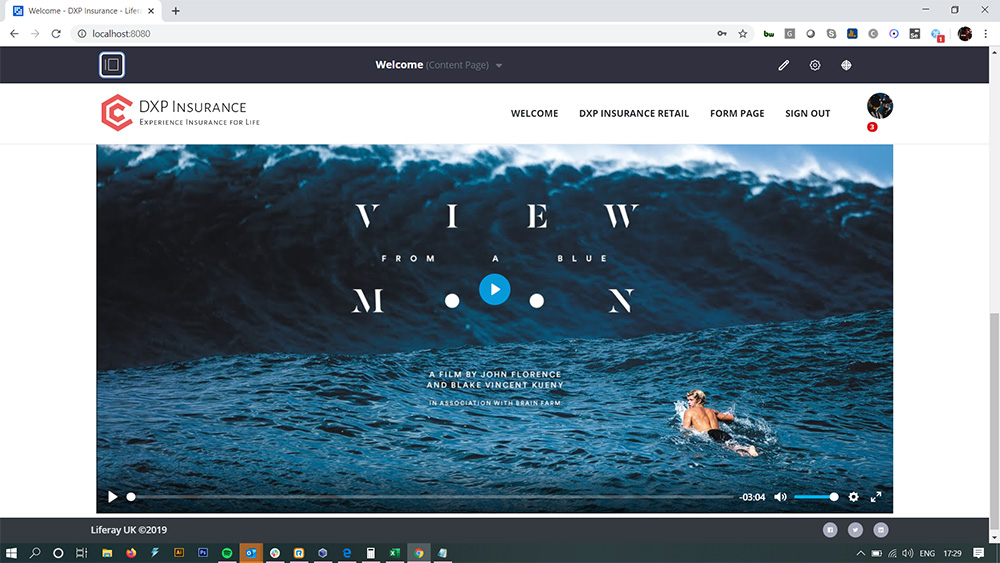
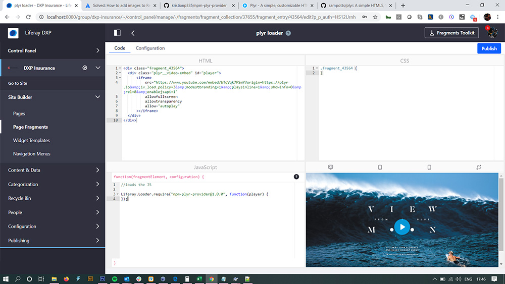

## Dynamic NPM dependency loading in Liferay

This is an example of a npm dependency module which in Liferay we call a provider. 

It is useful because you can dynamically add npm dependencies to your Liferay as OSGI modules and then call them asynchronously. You can call the module by loading via Liferay.Loader. In this example I am loading Plyr but it could be almost any dependency. I am also dynamically loading the CSS due to trick in Liferay Bundler which allows me to take CSS in a dependency and create an AMD module out of it. This way I can dynamically load the CSS at the same time as I load the JS.

You should call your dependency using Liferay.Loader. You can call it from pretty much anywhere in Liferay. Maybe a fragment, a content template, an Asset Publisher or even your Portlets.

```

Liferay.Loader.require("npm-plyr-provider@1.0.0", function(player) {
});

```
Checkout package.json, .babelrc, .npmbundlerrc, and index.js files for examples of using Liferay bundler and Babel.

**The gradle dependencies in this project are setup for Liferay 7.2, you can amend them for late versions of 7.0, and Liferay 7.1**

**Thanks to Ivan for his amazing Liferay Bundler work and help debugging**

[Liferay NPM Bundler](https://www.npmjs.com/package/liferay-npm-bundler)



As you can see in the image above the Plyr module basically swaps out the video player with a better more responsive and accessible version which can be styled.

[Plyr documentation](https://github.com/sampotts/plyr)

In Liferay I have a fragment with just some html and JS.

The HTML is as follows:

...

<div class="fragment_43564">
  <div class="plyr__video-embed" id="player">
      <iframe
          src="https://www.youtube.com/embed/bTqVqk7FSmY?origin=https://plyr.io&amp;iv_load_policy=3&amp;modestbranding=1&amp;playsinline=1&amp;showinfo=0&amp;rel=0&amp;enablejsapi=1"
          allowfullscreen
          allowtransparency
          allow="autoplay"
      ></iframe>
  </div>
</div>

...

The JS is:

...

Liferay.Loader.require("npm-plyr-provider@1.0.0", function(player) {
});

...



